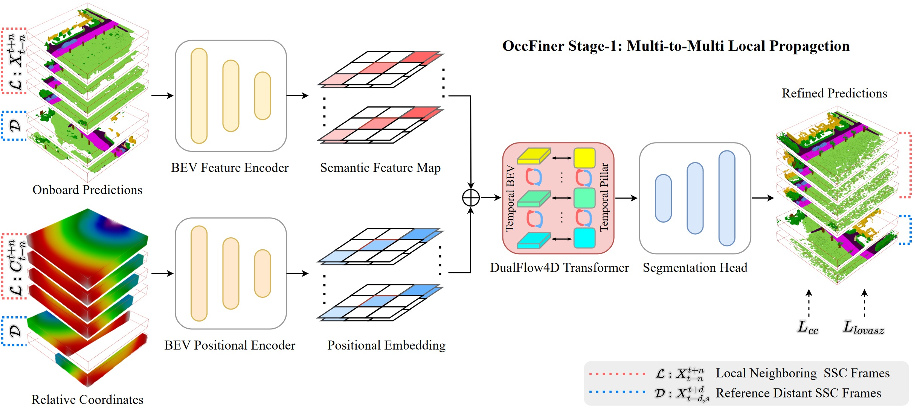

<div align="center">   
  
# OccFiner: Offboard Occupancy Refinement with Hybrid Propagation for Autonomous Driving
</div>


> **OccFiner: Offboard Occupancy Refinement with Hybrid Propagation for Autonomous Driving**

> [Hao Shi](https://scholar.google.com/citations?hl=zh-CN&user=0EI9msQAAAAJ), [Song Wang](https://www.researchgate.net/profile/Song_Wang25), [Jiaming Zhang](https://scholar.google.com/citations?user=8diau40AAAAJ&hl=zh-CN&oi=ao), [Xiaoting Yin](https://www.researchgate.net/profile/Yin-Xiaoting), [Zhongdao Wang](https://scholar.google.com/citations?user=VkKYpHIAAAAJ&hl=zh-CN&oi=ao), [Guangming Wang](https://scholar.google.com/citations?user=GGHfHSIAAAAJ&hl=zh-CN&oi=ao), [Jianke Zhu](https://scholar.google.com/citations?user=SC-WmzwAAAAJ&hl=zh-CN&oi=ao), [Kailun Yang](https://scholar.google.com/citations?user=pKFqWhgAAAAJ&hl=zh-CN&oi=ao), [Kaiwei Wang](https://scholar.google.com/citations?user=B6xWNvgAAAAJ&hl=zh-CN&oi=ao)

>  [[PDF]](https://arxiv.org/pdf/2403.08504) 


## News
- [2024/03]: Our paper is on [arxiv](https://arxiv.org/abs/2302.12251).
- [2024/02]: OccFiner achieve the SOTA on [SemanticKITTI 3D SSC (Semantic Scene Completion) Task](http://www.semantic-kitti.org/tasks.html#ssc) with **17.27% mIoU** and **45.54% IoU** (camera-only) / **37.82% mIoU** and **61.68% IoU** (lidar-only), under our offboard setting.
</br>


## Abstract
Vision-based occupancy prediction,
also known as 3D Semantic Scene Completion (SSC),
presents a significant challenge in computer vision.
Previous methods, confined to onboard processing,
struggle with simultaneous geometric and semantic estimation,
continuity across varying viewpoints,
and single-view occlusion.
Our paper introduces OccFiner,
a novel offboard framework designed to enhance the accuracy of vision-based occupancy predictions.
OccFiner operates in two hybrid phases: 1) a multi-to-multi local propagation network that implicitly aligns and processes multiple local frames for correcting onboard model errors and consistently enhancing occupancy accuracy across all distances. 2) the region-centric global propagation, focuses on refining labels using explicit multi-view geometry and integrating sensor bias, especially to increase the accuracy of distant occupied voxels.
Extensive experiments demonstrate that OccFiner improves both geometric and semantic accuracy across various types of coarse occupancy,
setting a new state-of-the-art performance on the SemanticKITTI dataset.
Notably, OccFiner elevates vision-based SSC models to a level even surpassing that of LiDAR-based onboard SSC models.
Furthermore, OccFiner is the first to achieve automatic annotation of SSC in a purely vision-based approach.
Quantitative experiments prove that OccFiner successfully facilitates occupancy data loop-closure in autonomous driving.
Additionally, we quantitatively and qualitatively validate the superiority of the offboard approach on city-level SSC static maps.


## Method

|                                                                                                                                                                                                                                                                          | 
|:--------------------------------------------------------------------------------------------------------------------------------------------------------------------------------------------------------------------------------------------------------------------------------------------------------------:| 
| ***Figure 1. Overall framework of the multi-to-multi local propagation network**. It accepts multiple onboard predictions and relative coordinates as input. This network adeptly executes error compensation and facilitates the implicit local propagation, improving SSC quality across various distances.* |


## Dataset

- [x] SemanticKITTI
- [x] KITTI-360


## TODO List

- [ ] Release the code.
- [ ] Support more model.
- [ ] Support more datasets.


## Bibtex
If this work is helpful for your research, please cite the following BibTeX entry.

```
@article{shi2024occfiner,
  title={Occfiner: Offboard occupancy refinement with hybrid propagation},
  author={Shi, Hao and Wang, Song and Zhang, Jiaming and Yin, Xiaoting and Wang, Zhongdao and Zhao, Zhijian and Wang, Guangming and Zhu, Jianke and Yang, Kailun and Wang, Kaiwei},
  journal={arXiv preprint arXiv:2403.08504},
  year={2024}
}
```